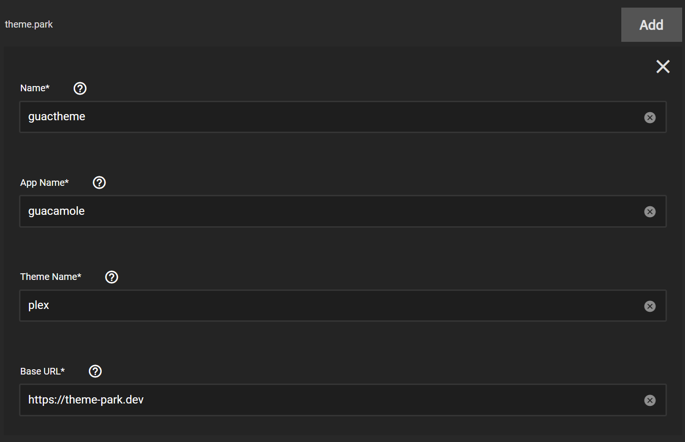
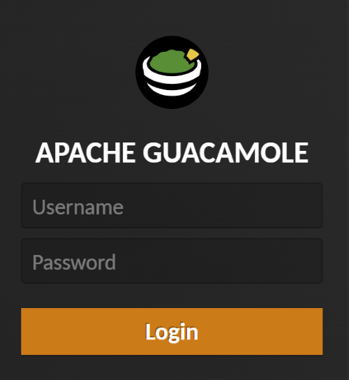

# Theme Park

Theme park is a middleware to inject [supported stylesheets (css)](https://docs.theme-park.dev/theme-options)
into [supported apps](https://docs.theme-park.dev/themes).

So let's see how to do that.

Note that this will only work on apps you have enabled `ingress`, and only when accessing them via the URL.
Will NOT work if you access them via `IP:PORT`.

## Creating the middleware on traefik

Edit your existing traefik install (or install fresh if you don't have it installed)

- Scroll down to `theme.park`
- Click <kbd>Add</kbd>
- Name: `guactheme` (Any name you want, remember it, you will need it later)
- App Name: `guacamole` (Replace with the name of the app you want to theme)
- Theme Name: `plex` (Replace wit the theme you want to apply)
- Base URL: (Leave the default, unless you plan to use a self hosted theme provider)
- Click <kbd>Save</kbd>

  

> Keep in mind that if you decide to use a self hosted theme provider, it will need to have enabled ingress.
> Also use the external URL, not the internal, as the client will need to access that theme provider to fetch the
> stylesheets.

## Applying the theme to the app

Edit your existing _App_, in this example we will use `guacamole-client`.

- Scroll down to `Traefik MIddlewares` (Remember, you need to have `ingress` enabled)
- Click <kbd>Add</kbd>
- Name: `guactheme` (Replace with the name you gave to your middleware on the previous step)
- Click <kbd>Save</kbd>

  

You are ready!

|                        Before                         |                        After                        |
| :---------------------------------------------------: | :-------------------------------------------------: |
|  |  |
